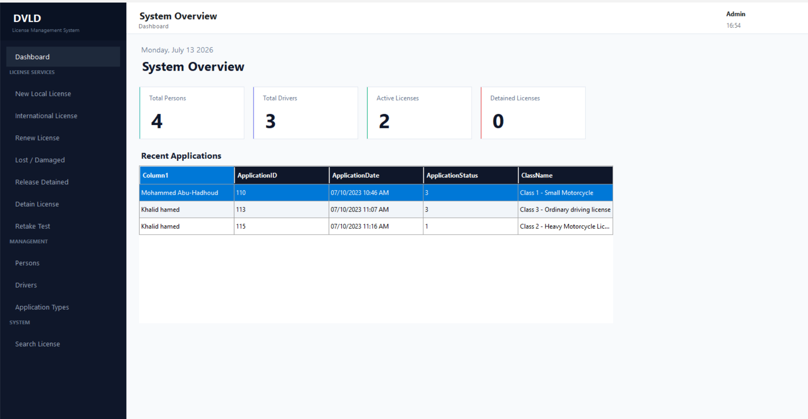
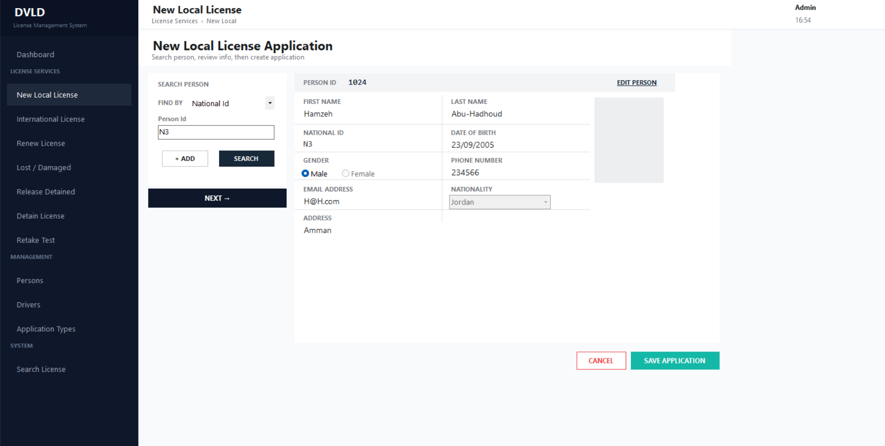
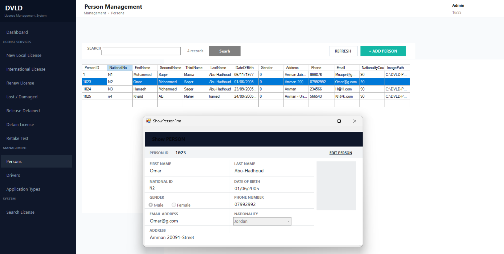
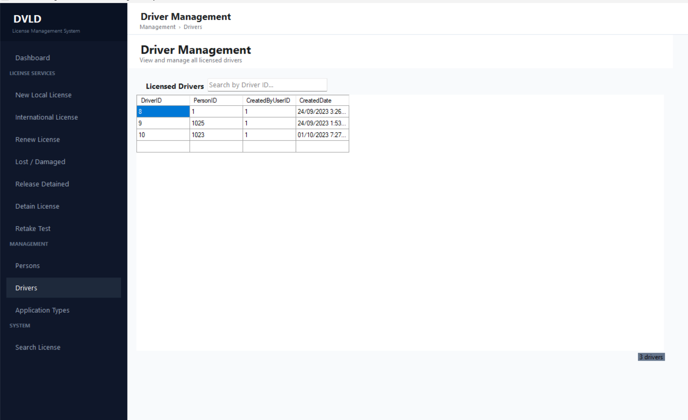
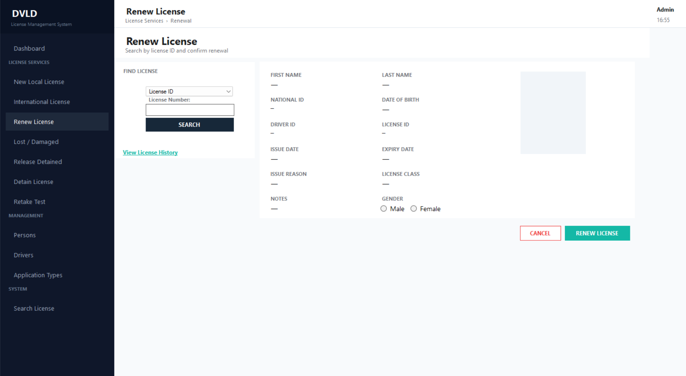
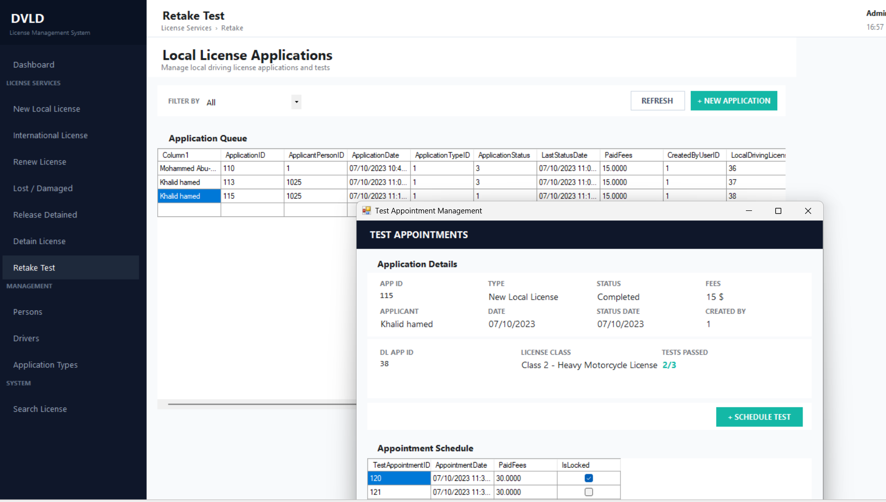

# 🚗 DVLD — Driving & Vehicle License Department System

A complete **desktop management system** for a Driving & Vehicle License Department, built with C# WinForms and a strict 3-layer architecture (Presentation / Business Logic / Data Access).

The system digitizes the full lifecycle of a driver's license — from person registration, through license applications and testing, to renewal, loss/damage handling, and detention/release — with role-based access control for administrators and staff.


---

## 📸 Screenshots

| Dashboard | New Local License Application |
|---|---|
|  |  |

| Person Management | Driver Management |
|---|---|
|  |  |

| Renew License | Retake Test / Appointments |
|---|---|
|  |  |

> Place your screenshot files inside `screenshots/` with the names above (or update the paths) before pushing.

---

## ✨ Features

- **Dashboard** — live system overview: total persons, total drivers, active licenses, detained licenses, and recent applications.
- **License Services**
  - New Local License applications
  - International License issuance
  - License Renewal
  - Lost / Damaged license replacement
  - License Detention & Release
  - Retake Test / Test Appointment scheduling and tracking
- **Management**
  - Person records (CRUD, search by National ID / name)
  - Driver records linked to persons
  - Application types configuration
- **System**
  - Global license search
  - Role-based login and permission enforcement
  - Full audit trail via `CreatedByUserID` / timestamps on core entities

---

## 🏗️ Architecture

The system follows a strict **3-Layer Architecture**:

```
DVLD.PL   → Presentation Layer   (Windows Forms, UI logic only)
DVLD.BLL  → Business Logic Layer (validation, rules, workflows)
DVLD.DAL  → Data Access Layer    (ADO.NET, stored procedures only)
```

**Key architectural decisions:**

- The **DAL never returns BLL objects** — it only returns primitive types / `DataTable`s where needed, keeping the layers properly decoupled.
- All database access goes through **stored procedures** (no inline SQL), improving security and centralizing query logic in SQL Server.
- Configuration (connection strings) lives in **App.config** on the host project, with the DAL built as a **Class Library** — avoiding the classic pitfall where a library project reads its own (non-existent) config instead of the host executable's.
- Role-based permissions are enforced at the BLL/PL boundary using an **Action delegate event pattern** for UI state changes (enabling/disabling controls based on the logged-in user's role).

---

## 🗄️ Database

- **SQL Server**, fully normalized relational schema covering Persons, Drivers, Licenses, Applications, License Classes, Test Appointments, Users, and Permissions.
- Ships with a ready-to-run **database creation script** (generated via SSMS *Generate Scripts*) — see [`/database`](./database).
- All CRUD operations are implemented as **stored procedures**, called exclusively from the DAL.

### Setup

1. Open SQL Server Management Studio (SSMS).
2. Run the script in [`/database/DVLD_Database_Script.sql`](./database/DVLD_Database_Script.sql) to create the database and all tables/stored procedures.
3. Update the connection string in `App.config` (in the `DVLD.PL` project) to point to your SQL Server instance.

---

## 🛠️ Tech Stack

| Layer | Technology |
|---|---|
| UI | C# Windows Forms (.NET Framework 4.7.2) |
| Business Logic | C# (BLL Class Library) |
| Data Access | ADO.NET + Stored Procedures |
| Database | Microsoft SQL Server |
| Architecture | 3-Layer (PL / BLL / DAL) |

---

## 🚀 Getting Started

### Prerequisites
- Visual Studio 2019 or later
- .NET Framework 4.7.2
- SQL Server (Express or higher) + SSMS

### Installation
```bash
git clone https://github.com/<your-username>/DVLD.git
cd DVLD
```
1. Set up the database as described in the [Database](#-database) section.
2. Open `DVLD.sln` in Visual Studio.
3. Update the connection string in `App.config`.
4. Set `DVLD.PL` as the startup project and run.

### Default Login
> Add your seeded admin credentials here (e.g. Username: `admin`, Password: `admin123`) once finalized.

---

## 📁 Project Structure

```
DVLD project/
├── Presentation Layer(DVLDproject)/  # Windows Forms UI
├── Businesss_Logic_Layer/            # Business logic, validation, workflows
├── DataAccesesLayer/                 # ADO.NET data access, stored procedure calls
├── database/                         # SQL Server creation script
└── screenshots/                      # README images
```

---

## 🧭 Known Improvements (Roadmap)

Transparency on what's next — tracked deliberately rather than hidden:

- [ ] Replace numeric status codes in list views (e.g. `ApplicationStatus`) with human-readable labels consistently across all screens
- [ ] Standardize modal/detail windows to match the main application's visual style (remove default system title bars from child forms)
- [ ] Add placeholder avatar for persons without an uploaded photo
- [ ] Clean up internal/technical grid columns (e.g. `ImagePath`) from user-facing views
- [ ] Fix minor labeling/typos in grid headers (e.g. `Gender`)

---

## 📚 What I Learned Building This

This project was built end-to-end as a structured learning exercise in professional software architecture:

- Enforcing strict layer separation (DAL/BLL/PL) and recognizing violations before they become technical debt
- Correct project sequencing (e.g., converting DAL to a Class Library **before** migrating configuration to `App.config`)
- Practical ADO.NET patterns: stored procedures, typed return objects instead of `DataTable` passthroughs
- Role-based UI permission enforcement using the `Action` delegate pattern
- Working around .NET Framework 4.7.2 limitations (e.g., no native `PlaceholderText` — implemented via `Enter`/`Leave` event handlers)

---

## 📄 License

This project is available for portfolio and educational purposes. Feel free to explore the code and reach out with questions.

## 👤 Author

**Ammar** — .NET Developer (Backend & Desktop)
[GitHub](https://github.com/<your-username>) · [LinkedIn](https://linkedin.com/in/<your-profile>)
